<p align="right"><a href="README.md">Deutsch</a> · <b>English</b></p>

<h1 align="center">☕ Bezzera Duo Protocol</h1>

<p align="center">
  <b>The protocol between the mainboard and the touch display of the Bezzera Duo / Matrix</b> — decoded, documented<br />
  and made usable with an ESP32 bridge including a web UI.
</p>

<p align="center">
  
  
  
  
  
</p>

<p align="center">
  Capture, understand, control — without touching the machine logic: the mainboard stays in charge,<br />
  the ESP32 only sits in the line and speaks the same language as the display.
</p>

<p align="center">
  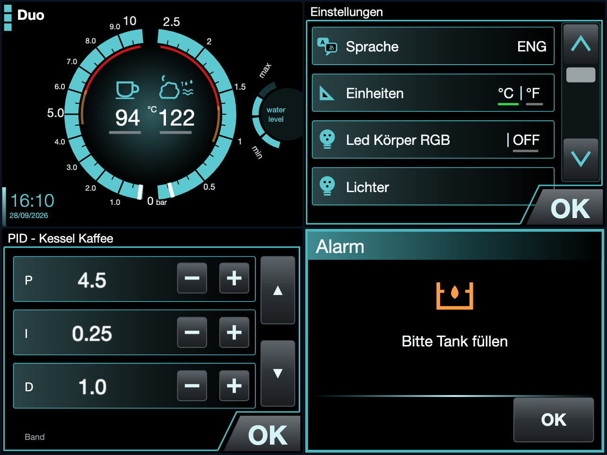
  <br />
  <sub><i>The display replica in the web UI — drawn from the screenshots in the Bezzera manual and our own photos of all 300 pages, operable with the touch areas from the display flash. The manufacturer logo is deliberately replaced by a neutral wordmark.</i></sub>
</p>

---

## ✨ Overview

The Bezzera Duo DE/MN and the identical Matrix have a 3.5" touch display
(5963201.xx) connected to the mainboard (7661047.xx). This repo describes **what
runs over the four wires in between** and provides the tools to read it and to
speak it yourself. The goal is the same as in the Reddit project by
*Vivid-Ad-2039*: an ESP32 that reads and writes registers.

✅ Protocol measured: DWIN **Mini DGUS**, frame header `C6 A5`, 115200 baud, TTL  
✅ **All 300 pages** photographed and catalogued (three languages)  
✅ **All 1070 buttons** with area, target page and value — read from the display flash  
✅ ESP32 bridge: pass-through and capture on the machine  
🧪 ESP32 bridge: inject button presses, emulate the display  
✅ Web UI with display replica and live values, run against the real display  
🧪 Beyond the display: remote on/off, Home Assistant, brew by weight, 24 h history  

✅ tested · 🧪 built, not yet tested on the machine · 💡 idea / assumption — details under [Status](#-status)

> ⚠️ The machine carries **230 V**. Pull the mains plug before you connect
> anything. With the machine running, only touch measurement leads that are
> already in place. Boilers and steam are hot.

---

## 📸 Screenshots

<table>
  <tr>
    <td width="50%" align="center">
      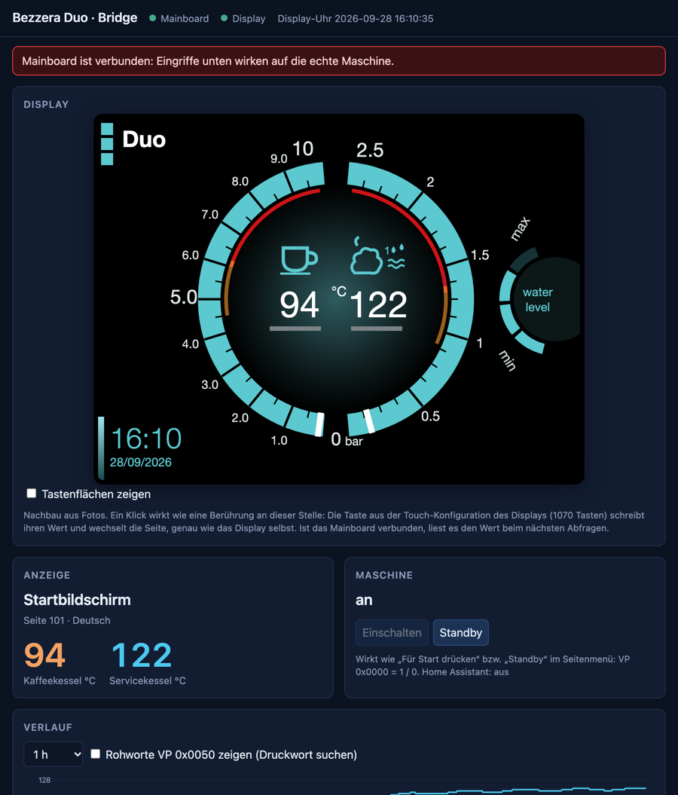<br />
      <b>Web UI of the bridge</b>
    </td>
    <td width="50%" align="center">
      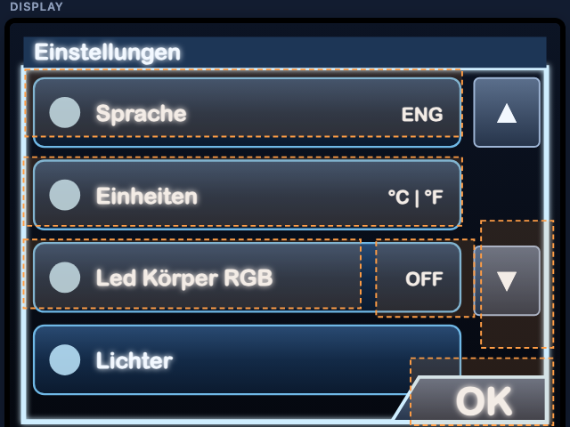<br />
      <b>Touch areas from the flash, overlaid</b>
    </td>
  </tr>
  <tr>
    <td width="50%" align="center">
      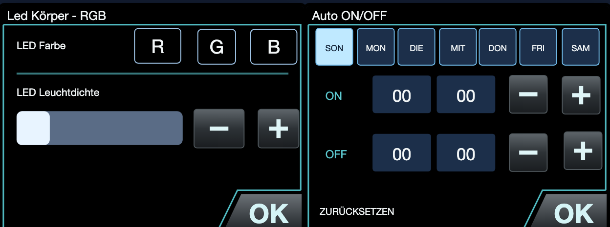<br />
      <b>Replicated settings pages</b>
    </td>
    <td width="50%" align="center">
      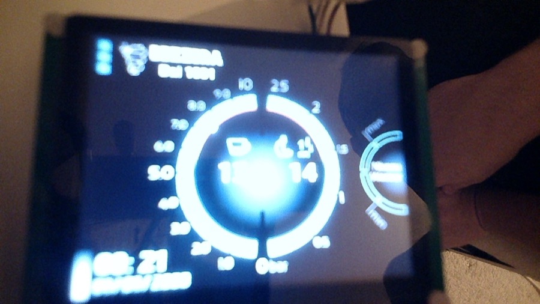<br />
      <b>The original (webcam, test values 13/14)</b>
    </td>
  </tr>
  <tr>
    <td colspan="2" align="center">
      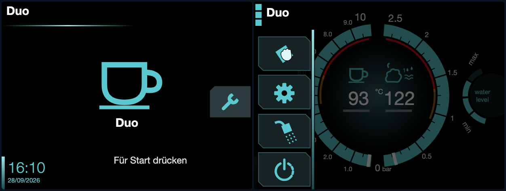<br />
      <b>Standby and side menu (cleaning, settings, backflush, standby)</b>
    </td>
  </tr>
  <tr>
    <td colspan="2" align="center">
      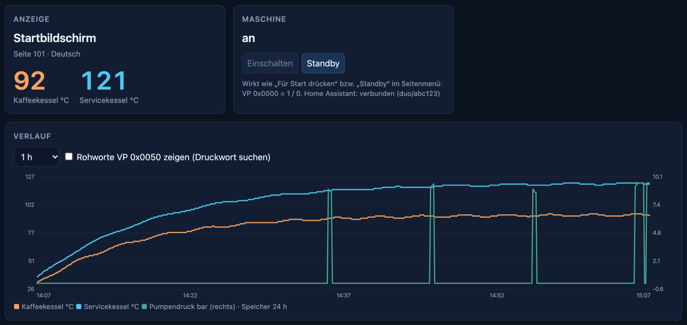<br />
      <b>On/off and 24 h history (simulation with <code>web_lokal.py --demo</code>)</b>
    </td>
  </tr>
  <tr>
    <td colspan="2" align="center">
      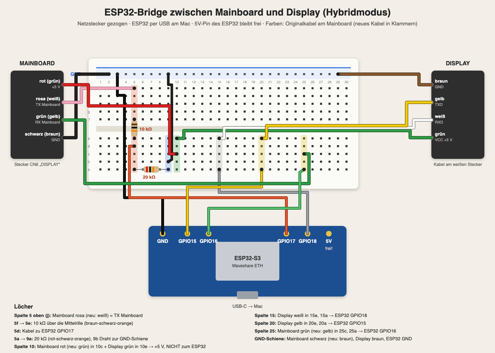<br />
      <b>Wiring plan of the bridge with hole positions</b>
    </td>
  </tr>
</table>

---

## 📊 Status

Everything in the repo is assigned to one of three levels. The complete list,
with evidence for each statement, is in [`docs/stand.en.md`](docs/stand.en.md).

| | Level | means |
|---|---|---|
| ✅ | **tested** | observed, measured, read or tried on the real machine or the real display |
| 🧪 | **built, untested** | implemented and compiled, partly checked in simulation, never tried on the machine |
| 💡 | **idea / assumption** | derived from the manual, photos, datasheets or by analogy, not confirmed |

| Topic | Status |
|---|---|
| Protocol, levels, wires, power-up sequence, temperatures, firmware version | ✅ measured (logic analyzer, 2026-09-27) |
| Page catalogue (0–299), button table (1070 buttons) | ✅ photographed or read from the flash |
| Bridge pass-through / capture | ✅ on the machine |
| Web UI with display replica | ✅ run against the real display (live values, pages, values read from the display) · 💡 whether a click has an effect on the machine |
| Display emulation, hybrid mode | 🧪 |
| An external button press acts like a real one | 💡 core assumption behind all remote control, never tried |
| On/off, Home Assistant, history, brew by weight | 🧪 checked in simulation, not on the machine, with no real scale |
| Pressure word, page x06 as dispense counter, stop via the continuous-dispense button | 💡 |
| Continuous operation (password, OTA, watchdog, power supply) | 💡 not built |

All captures come from the cold machine with an empty tank; a shot has never
been on the line.

---

## 🗂️ Contents

- [📊 Status](#-status) — what is tested ✅, built 🧪 or only assumed 💡 ([complete](docs/stand.en.md))
- [🔌 Hardware](#-hardware) — display, mainboard, connectors and wires ([details](docs/bauteile.md))
- [📡 The protocol](#-the-protocol) — Mini DGUS, what was measured
- [🖥️ Pages and buttons](#️-pages-and-buttons) — catalogue and touch configuration from the flash
- [🧪 Measuring and capturing](#-measuring-and-capturing) — levels, logic analyzer, sniffer
- [🌉 ESP32 bridge](#-esp32-bridge) — wiring, modes, commands, web UI
- [☕ Beyond the display](#-beyond-the-display) — on/off, Home Assistant, brew by weight, history
- [🧰 Tools](#-tools) — all scripts at a glance
- [🧭 Next steps](#-next-steps)
- [📚 Sources](#-sources)

---

## 🔌 Hardware

### The display

**DWIN DMT32240M035_07WTZ4**, date code `180814` (August 2018), printed
„5V ONLY“. DWIN displays are ready-made serial HMI modules: images, fonts
and the layout of the touch areas are stored in the display's flash. It has **no
machine logic** — it shows variables and reports touch input over UART.

- **Connection:** four wires soldered directly to pads on the right edge, secured
  with hot glue. Pads from the top: `GND GND GND NC TXD RXD VCC VCC`. Used are
  **GND (brown), TXD (yellow), RXD (white), VCC (green)**; the wires end in a
  white intermediate connector.
- **Level measured: TTL**, TXD +3.2 V at idle. The 16-pin IC next to the
  pads is not an obstacle; there is no RS-232.
- **Firmware version** (register `0x00`): `0x22`. The splash screen shows „TFT 2.0“.
- **Memory:** two TSOP-48 chips (parallel NAND flash or RAM), **no
  SPI flash** — the project cannot be read out with a CH341A. In addition a
  microSD slot (for loading only, `DWIN_SET`) and an **empty**
  coin cell holder; the clock is set by the mainboard.
- **Touch:** capacitive, flat cable `CDQ9439-3.5-A` with its own controller
  **SiS9252** and a 6-pin connector (`VDD` on pin 6). Replacement panels on the
  market almost always have FocalTech or Goodix controllers and therefore
  probably do not fit.
- **Finding:** When the 6-pin touch connector is wiggled, the display
  beeps intermittently — the touch is alive, the fault is a **loose contact**. The
  touch registers showed the last real touch at x=286, y=234, exactly on „OK“.
- **LCD panel:** probably LQ035NC111, 3.5" QVGA with a 54-pin RGB flat cable.
- **Details** on the intermediate connector, SiS9252, touch repair, LCD panel and
  type number: [`docs/bauteile.md`](docs/bauteile.md).
- An unpopulated row of 5 pads in the middle is probably a
  programming or debug header; at the bottom there is an unused DWIN connector.

### The mainboard

**The manufacturer is PRO.EL.IND (Italy), not Gicar.** Cover labels
`SDEDB` / `BZ1PTE` / `7661047PR`, production label `1809` (September 2018).
Supply 12 V DC, fuse 3.15 A.

| Component | What it is | Significance |
|---|---|---|
| NXP **MC9S08PA32** (LQFP-64) | 8-bit S08 MCU, 32 KB flash | all of the machine logic; speaks TTL |
| **CNPR**, 4-pin header | probably BDM programming header | factory update; locked if the security bit is set — hands off |
| ST **M41T56** + crystal + coin cell | I²C real-time clock | sets the display clock at start-up |
| RECOM DC/DC converter | 12 V → 5 V | the 5 V for the display |
| ULN2003 + 5 Omron relays, TLP3063 | relay and load drivers | group heater, solenoid valves, pump |
| Connector **CN6 „DISPLAY“** | 4 wires | the line to the display |

Pinout according to the cover label: relay outputs 1 group heater, 2 EV mains water,
3 EV tank, 4 EV fill (steam boiler), 5 EV group, 6 pump, 7 common · sensors NTC
group, NTC coffee, NTC steam, SSR coffee, SSR steam · **PRESS.** pressure sensor ·
**CAP. SENS** capacitive level sensor · terminal block flow meter, microswitch
(lever, MN only), S.LIV · LED FRONT/RETRO · **KEYBOARD** (grey ribbon cable
to the keypad of the DE). So the mainboard is the master
and holds PID, setpoints, passwords and chrono — a mainboard reset sets the
passwords back to 1901/1906.

### Connectors and wires

| CN6 pin (from left) | Original cable | Display cable / replacement cable | Display pad | Signal |
|---|---|---|---|---|
| 1 | **red** | **green** | VCC | +5 V |
| 2 | **pink** | **white** | RXD | mainboard → display, 4.8 V |
| 3 | **green** | **yellow** | TXD | display → mainboard, 3.2 V |
| 4 | **black** | **brown** | GND | GND |

A replacement cable with the display colours is therefore wired 1:1.

The white intermediate connector is probably **Molex Mini-Fit Jr.** (4.2 mm); the
complete cable is available as spare part **Bezzera 7663518**. Part numbers:
[`docs/bauteile.md`](docs/bauteile.md).

---

## 📡 The protocol

### DWIN „Mini DGUS“

DWIN's M series (DMT…M…) runs „Mini DGUS“, the same family as in the
Wanhao i3 Plus printer, for which [ADVi3++](https://github.com/andrivet/ADVi3pp)
implemented the protocol:

```
Header | LEN | CMD | parameters | data        LEN = bytes from CMD on

80 reg data...         write register         80 03 00 05  -> switch to page 5
81 reg n               read register          reply: 81 reg n data...
82 vpH vpL words...    write variable         82 10 00 03 A7 -> VP 0x1000 = 935
83 vpH vpL n           read variable          reply: 83 vpH vpL n words...
84 ...                 curve data
```

Words are big-endian. Important registers: `00` firmware, `03` current page
(PIC_ID), `05`–`07` touch, `1F`/`20` clock, `40`–`48` flash access (LibOP), `4F`
key code.

### Measured on a Duo DE

| | |
|---|---|
| Frame header | **`C6 A5`** (instead of the DWIN standard `5A A5`) |
| Baud rate | 115200, 8N1, not inverted, **no CRC** |
| Idle level | display TXD +3.2 V, mainboard TX +4.8 V (TTL) |

**Power-up sequence** (mainboard → display):

1. Page 90, the splash screen with „TFT 2.0“ and „FW: x.y“
2. Write VP `0x0063` = 21 and read it back — **connection test**; the echo must match
3. Set the clock (`80 1F 5A` + date/time in BCD) and read it back
4. Page 101, VP `0x0000` = 1, page 103 if the tank is empty

**Normal operation:**

| VP | Direction | Interval | Meaning |
|---|---|---|---|
| `0x0000` | mainboard reads | 100 ms | key code of the display (navigation, actions) |
| `0x0001` | mainboard reads | 100 ms | second key code (rare) |
| `0x0002` | mainboard reads | on settings pages | „OK“ in settings |
| `0x0050` | mainboard writes | ~300 ms | 9 words of status: **word 3 coffee boiler °C, word 4 service boiler °C**; word 2 becomes 1 after page 103, word 7 = 3, word 5 was 1 once for 1 s; words 0, 1, 6, 8 so far 0 (cold machine, empty tank) — the pressures are suspected there |
| `0x0063` | mainboard writes | at start-up | mainboard firmware version × 10 (21 → „FW: 2.1“) |

**Pressures:** According to the manual, the home screen has two pressure gauges: on the left
the **pump pressure 0–10 bar**, on the right the **service boiler pressure
0–2.5 bar**; the mainboard has the PRESS. connector for this. Which word
carries them will be shown by a capture during heat-up with a full tank, or by the
variable configuration (`14.bin`) from the display flash.

All buttons are of type `FDxx`: **the display reports nothing on its own**;
the mainboard polls. Pure page changes are handled locally by the display, without
the mainboard knowing about them.

---

## 🖥️ Pages and buttons

### 300 pages, three languages

| Range | Language |
|---|---|
| 0–95 | English |
| 100–195 | German |
| 200–295 | Italian |
| 96–99, 196–199, 296–299 | empty |

The same page in the other language is almost always at +100 or +200
(exceptions in the technician menu). Photos of all pages: [`docs/seiten/`](docs/seiten/),
catalogue with the content of every page: [`docs/seiten.md`](docs/seiten.md).

### 1070 buttons from the display flash

The touch configuration (DGUS `13.bin`) is stored in the display's flash and can
be copied into variable memory via the LibOP registers **read-only** (`0x41 = 0xA0`)
— contrary to what the manual says, also below the
`0x40` areas. Result in [`docs/tasten.json`](docs/tasten.json): for each button
area, target page, function and value.

| Function | where to | Example |
|---|---|---|
| Key code | VP `0x0000` | „OK“ on „Bitte Tank füllen“ (Please fill tank) → 5, coffee → 7, menu → 20 |
| „OK“ in settings | VP `0x0002` = 1 | settings pages |
| ± changed by the display itself | VPs `0x0007`, `0x000B`, `0x0020`–`0x0032`, `0x005A`–`0x005F`, `0x0070`–`0x007E` | pre-infusion `0x005C`, 0–50 in steps of 5 |

Pitfalls when reading the flash:

- at most **32 words per frame**; larger replies never arrive
- from VP `0x2000` there is an internal receive buffer; VP addresses above `0x3FFF` mirror
- a read block at flash address `0x1000` always fails — read with an offset
- occasionally bytes flip on the line: read every block twice
- in the flash itself, one byte on the **English page 9** is corrupted
  (`F3` instead of `FE`); the „Coffee“ button of the boiler priority there
  probably has no effect. German (109) and Italian (209) are fine

The flash dump itself (`flash/`) is **not** in the repo — only the button
table derived from it.

**What does not work:** A touch cannot be faked over the data line.
Register `0x4F` only acts on buttons configured for it
(none here), and the display merely stores the touch registers `0x05`–`0x07`.
Button presses therefore reach the machine via the replies to the mainboard.

---

## 🧪 Measuring and capturing

### Check the levels before connecting anything

Machine on, multimeter (DC), black probe on GND:

| measured at idle | means | connect via |
|---|---|---|
| approx. +3.3 V | TTL 3.3 V | directly |
| approx. +5 V | TTL 5 V | voltage divider 10k/20k |
| **approx. −5 to −12 V** | **RS-232** | **MAX3232**, never directly |

Measured on the Duo DE: +4.8 V from the mainboard, +3.2 V from the display.

### Logic analyzer (24 MHz, 8 channels, „fx2lafw“)

```bash
brew install sigrok-cli
sigrok-cli -d fx2lafw --config samplerate=2m --time 45s -C D0,D1 -o boot.sr
python3 tools/sr2log.py boot.sr > boot.log          # UART, baud rate automatic
python3 tools/duo_sniff.py dgus --changes boot.log   # DGUS frames, header automatic
python3 tools/duo_live.py                           # live view directly from the analyzer
```

Alternatively [PulseView](https://sigrok.org/wiki/Downloads) (Windows: install
WinUSB via Zadig first). Raw captures with descriptions: [`captures/`](captures/).

<details>
<summary><b>Pitfalls with the fx2lafw clone (macOS, Apple Silicon)</b></summary>

- **Only with USB High Speed (480 Mb/s).** At „Link Speed: 12 Mb/s“ every
  capture aborts with `LIBUSB_ERROR_PIPE` — use a different cable or port.
- When plugged in, macOS asks whether to allow the accessory to connect; until then the device is invisible.
- Before its firmware is loaded it reports without a name (`0925:3881`);
  `sigrok-cli --scan` loads it, after which it is called `fx2lafw`.
- **A changed sample rate only takes effect from the next run.** The first
  capture after a change is labelled wrongly; the baud rate appears
  doubled or halved. Do a warm-up run with `--samples 1000`; `duo_live.py` does this itself.

</details>

### ESP32 sniffer (read-only)

[`sniffer/duo_sniffer/duo_sniffer.ino`](sniffer/duo_sniffer/duo_sniffer.ino) for
any classic ESP32 devkit: two UART inputs, sends nothing, the display
keeps running normally. Output over USB at 921600 baud in the log format of
`duo_sniff.py`; markers with `m <text>`, baud rate with `b`, inversion
with `i`; `scan` measures the idle level and the shortest pulse.

The cleanest tap is a Y adapter for the intermediate connector: one
receptacle and one plug housing each with contacts (Mini-Fit Jr.: 39-01-4040 +
39-01-4046, 39-00-0038 + 39-00-0041), wired through 1:1 with branches on TX,
RX and GND; +5 V stays unconnected. Measure the pitch first; at 3.0 mm use the
Micro-Fit parts. A 2.54 mm stacking header does not fit.

```
Data line 1 ──[10k]──┬── GPIO16 (channel A)      voltage divider only for 5 V level
                     └──[20k]── GND
Data line 2 ──[10k]──┬── GPIO17 (channel B)
                     └──[20k]── GND
Machine GND ──────────────── ESP32 GND
```

---

## 🌉 ESP32 bridge

Firmware [`bridge/duo_bridge/`](bridge/duo_bridge/) for the **Waveshare
ESP32-S3-ETH**. The ESP32 sits *in* the line, passes frames through,
captures them, injects its own frames or answers the mainboard itself.

```bash
arduino-cli core install esp32:esp32
FQBN=esp32:esp32:esp32s3:CDCOnBoot=cdc,PartitionScheme=min_spiffs,PSRAM=opi
arduino-cli compile --fqbn $FQBN bridge/duo_bridge
arduino-cli upload  --fqbn $FQBN -p /dev/cu.usbmodem… bridge/duo_bridge
```

With Bluetooth the firmware no longer fits into the default partition (1.2 MB),
hence `min_spiffs` (1.9 MB). `PSRAM=opi` for the ESP32-S3R8 of the Waveshare board:
with it the history covers 24 h instead of 30 min. Without PSRAM everything else works the same.

### Wiring

Wiring plan with hole positions: [`docs/breadboard_hybrid.png`](docs/breadboard_hybrid.png).

| Connection | how |
|---|---|
| Mainboard **black** (replacement cable brown) + display **brown** | ESP32 **GND** |
| Mainboard **red** (green) ↔ display **green** | directly, **not** to the ESP32 |
| Mainboard **pink** (white) | **10 kΩ → GPIO17**, GPIO17 **20 kΩ → GND** |
| ESP32 **GPIO18** | → display **white** |
| Display **yellow** | → ESP32 **GPIO15** |
| ESP32 **GPIO16** | → mainboard **green** (yellow) |
| ESP32 **5V** | unconnected |

**Display only, without the machine** (cycling through pages, reading the flash): display
green to ESP32 **5V**, brown to GND, yellow to GPIO15, white to GPIO18.

<details>
<summary><b>Pitfalls when building</b></summary>

- **Swapping display brown and display green reverses the display's polarity.** Its
  protection diode then shorts the machine's 5 V (~0 V on the supply).
  The display survived it.
- **Without a common ground** only garbage bytes arrive: connect machine GND directly to
  a GND pin of the ESP32.
- **Swapping 10 kΩ and 20 kΩ** gives ~1.6 V at GPIO17, right in the threshold region —
  garbled data. Correct: 10 kΩ between the line and GPIO17, 20 kΩ to GND.
- **Never also plug the display directly into the machine** while the
  ESP32 is in the line: two transmitters on one line, 5 V from two sources.

</details>

### Modes

| Mode (`e`) | Who answers the mainboard | used for |
|---|---|---|
| **0** pass-through | the display | capturing; `o` injects individual button presses |
| **1** emulation | the ESP32 from its model (VPs, registers, running clock) | without a display; must catch the machine's start-up |
| **2** hybrid | the display; VPs set via web/`w` are replaced by the ESP32 | control while the display is running |

The mode is stored and persists after a restart.

**Finding on starting without a display:** Without the display's reply line
the machine does not continue its start-up; with the display in parallel to the ESP32 it crashes (two
replies at the same time). The probable cause is the connection test with VP
`0x0063`: the emulator had missed the write because the divider on
GPIO17 was wrong at the time, and replied with 0. With the correct divider,
valid frames arrived even without a display. There is no „start byte“ from the display.

### Commands over USB

`python3 tools/bridge.py "<command>"` or `arduino-cli monitor -p … -c baudrate=921600`:

| Command | Effect |
|---|---|
| `p <page>` | switch the display to a page |
| `w <vp> <word> …` | write a VP in the display (and in the model) |
| `o <vp> <value> [n]` | override the next n replies to „read VP“ — a button press for the mainboard |
| `d <hex …>` / `m <hex …>` | raw bytes to display / mainboard |
| `s <from> <to> [ms]` | cycle through pages |
| `e [0\|1\|2]` | mode: pass-through, emulation, hybrid |
| `n <ssid> <password>` | store home Wi-Fi (2.4 GHz only); `n ?` lists networks, `n -` deletes |
| `j [since]` | state as a JSON line `#J {…}` |
| `z <path> [body]` | extra API as in the web UI, e.g. `z /api/aktion an`; reply as a line `#Z …` |
| `M <hex …>` / `D <hex …>` | test: handle a frame as if it came from the mainboard / display |
| `x` / `?` | capture output on/off / state |

### Web UI

- **On the computer, without Wi-Fi:** `python3 tools/web_lokal.py` → http://localhost:8080,
  talks to the ESP32 over USB. With `--demo` entirely without an ESP32: simulated
  machine and scale.
- **Own Wi-Fi** `duo-bridge` → http://192.168.4.1, on the home network http://duo.local
  or via Ethernet (W5500).

It shows the **display replica** (320 × 240, SVG, all page types) with
live values; a click acts like a touch at that position — write a
value, ± within the limits from the flash, change page. In addition on/off,
history, brew by weight, settings, all VPs, event log and page catalogue. The
„Mainboard“ lamp only lights up on valid frames; garbage bytes appear in the log.

> 🔒 No login, and the password of the bridge's own Wi-Fi is public here —
> only run it for testing on your own network. For continuous operation the ESP32
> gets its own password (see [Next steps](#-next-steps)).

---

## ☕ Beyond the display

Everything runs on the ESP32 itself, even without the web UI open. Settings
(MQTT, scale, stop output, pressure word) are in the „Einstellungen“ (Settings) box of the
web UI and are stored in the ESP32's NVS, never in the source code.

| Function | how | Status |
|---|---|---|
| **Remote on/off** | writes VP `0x0000` = 1 and page x01 („Für Start drücken“, Press to start) or VP `0x0000` = 0 and page x00 („Standby“ in the side menu), exactly like these buttons according to the touch configuration | 🧪 built · 💡 effect on the machine |
| **Home Assistant** | MQTT with discovery, see below | 🧪 |
| **History** | VP `0x0050` once per second into a ring buffer, 24 h with PSRAM (otherwise 30 min); chart 10 min to 24 h | 🧪 simulation |
| **Pressure curves** | as soon as it is known which word in VP `0x0050` carries the pressure: „Rohworte zeigen“ (Show raw words) in the history, run the pump, enter the rising word under settings | 🧪 built · 💡 pressure word |
| **Brew by weight** | Bluetooth or Wi-Fi scale, shot is detected, chart of weight, flow and pressure, stop at target minus learned stop offset via the stop button of the keypad | 🧪 built · 💡 stop via the keypad |
| **Count shots, report alarms** | counter in NVS, alarm pages (tank, maintenance, filter …) as state and alarm | 🧪 simulation |

<p align="center">
  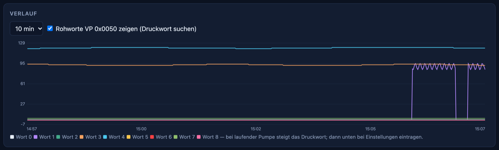<br />
  <sub>Finding the pressure word: „Rohworte zeigen“ (Show raw words) in the history. Here, in the simulation, word 1 rises while the pump runs.</sub>
</p>

### Cross-check against the measurements

Levels as in [`docs/stand.en.md`](docs/stand.en.md): ✅ tested · 🧪 built, untested · 💡 idea / assumption.

All captures in [`captures/`](captures/) come from the cold machine with an
empty tank (temperatures 22–36 °C, page 103 „Bitte Tank füllen“). A shot
has never been on the line. It follows:

| Assumption of the extra functions | measured / evidenced | open |
|---|---|---|
| On = VP `0x0000` → 1 | The mainboard itself writes VP `0x0000` = 1 at power-up (`boot.sr`); the „Für Start drücken“ button writes 1 (flash, DE and IT) | whether the mainboard reacts to a 1 set from outside |
| Standby = VP `0x0000` → 0 | The „Standby“ button in the side menu writes 0 (flash, all three languages) | never captured |
| State from the key value | The display reports VP `0x0000` every 100 ms (`boot.sr`, `home.sr`, `tank.sr`); after „OK“ it stayed at 5 | — |
| Alarms from the page | The mainboard itself switches to page 103 (register `0x03`, `boot.sr`) | other alarms |
| Pressure word in VP `0x0050` | Words 0, 1, 6, 8 always 0 — the pump never ran | which word rises while the pump runs |
| Dispense counter on page x06 | Photo of page 106: only the pump pressure needle and a large number; manual 5.4.4 | whether the mainboard switches there during a shot, which VP carries the time |
| Stop via the keypad | Manual 5.4; KEYBOARD connector on the mainboard (photo) | pinout of the ribbon cable |

The bridge therefore reads the on/standby state from the key value, not from the
page: the display performs touch page changes without reporting them to the mainboard.
The next capture should be a complete shot with a full tank.

### Home Assistant

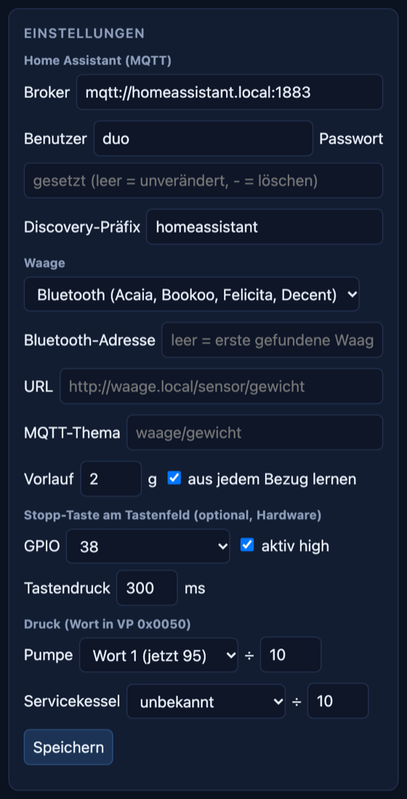

Enter the broker under settings (e.g. `mqtt://homeassistant.local:1883`,
user and password of the Mosquitto add-on). Home Assistant then finds the device
**Bezzera Duo** on its own:

Entity names are German, as the firmware creates them:

| Entity | Type |
|---|---|
| Kaffeekessel, Servicekessel (coffee / service boiler) | temperature °C |
| Pumpendruck, Druck Servicekessel (pump / service boiler pressure) | pressure bar, only once the pressure word has been entered |
| Zustand, Alarm (state, alarm with text) | „Standby“, „an“ (on), „Alarm: Tank füllen“ (Alarm: fill tank) … |
| Maschine (machine) | switch on/standby |
| Gewicht, Durchfluss, Bezug läuft, Letzter Bezug, Letzter Bezug Dauer, Bezüge (weight, flow, shot running, last shot, its duration, shot count) | only with a scale |
| Zielgewicht, Tara (target weight, tare) | number and button, only with a scale |
| Bezug stoppen (stop shot) | button, only with a stop output |
| Waage (scale) | diagnostic |

Topics: `duo/<id>/zustand` (JSON), `duo/<id>/verfuegbar`, `duo/<id>/ereignis`
(`bezug_start`, `ziel_erreicht`, `bezug_fertig`), commands under
`duo/<id>/set/maschine|ziel|tara|aktion`. `<id>` is the last six digits
of the MAC; the web UI shows the base topic. Schedules and
notifications („machine hot“, „tank empty“) run as automations in
Home Assistant, for example:

```yaml
automation:
  - alias: Preheat espresso machine
    triggers: [{trigger: time, at: "06:30:00"}]
    conditions: [{condition: time, weekday: [mon, tue, wed, thu, fri]}]
    actions: [{action: switch.turn_on, target: {entity_id: switch.bezzera_duo_maschine}}]
  - alias: Espresso ready
    triggers: [{trigger: numeric_state, entity_id: sensor.bezzera_duo_kaffeekessel, above: 92}]
    actions: [{action: notify.notify, data: {message: "The Duo is hot."}}]
```

### Brew by weight

<br clear="right" />

<p align="center">
  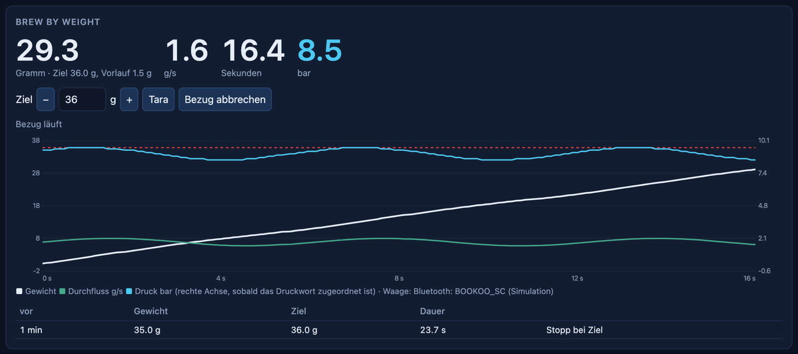<br />
  <sub>Running shot in the simulation: weight (white) with target line, flow (green), pump pressure (blue), below it the last shots.</sub>
</p>

**Scales**, selected under settings:

| Type | Scales | Note |
|---|---|---|
| Bluetooth | Acaia (Lunar, Pearl, Pyxis, Cinco), BOOKOO Themis, Felicita Arc/Incline, Decent Scale / Half Decent | the first one found, or enter a fixed address. Protocols after [AcaiaArduinoBLE](https://github.com/tatemazer/AcaiaArduinoBLE), [BooKoo](https://github.com/BooKooCode/OpenSource) and [Decent](https://decentespresso.com/decentscale_api) |
| Wi-Fi: poll URL | anything with an HTTP interface, e.g. ESPHome with HX711 (`http://waage.local/sensor/gewicht`) | reply as a number or JSON with `value`, `weight` or `gewicht`, about 8 polls per second |
| Wi-Fi: scale reports itself | `POST http://duo.local/api/waage` with the weight in g, or an MQTT topic | the bridge handles tare for Wi-Fi scales itself |

**Procedure:** Cup on the scale, start the shot with the continuous-dispense button
(portion buttons also work; then the volumetric control stops as well). The bridge
detects the shot from the first drops (steadily rising weight, no
jump) or, once the pressure word is known, from the pump pressure. The time counts
from then on. When weight + stop offset reaches the target, the message „Ziel erreicht –
Bezug stoppen!“ (Target reached – stop the shot!) appears in the web UI and the event `ziel_erreicht` in Home
Assistant. After the shot the bridge adjusts the stop offset (the drip after stop)
with half the step size.

**Stopping via the keypad.** The DE has a keypad with five buttons:
four portions (volumetric via the flow meter) and the
continuous-dispense/programming/stop button. According to the manual (5.4), pressing
the continuous-dispense button again ends the dispensing; the mainboard then stops the pump
itself. The keypad is connected via the grey ribbon cable directly to the
**KEYBOARD** connector of the mainboard, not to the display line. So the buttons
themselves do not arrive over the display line; the bridge has to „press“ the button
electrically:

- Under „Stopp-Taste am Tastenfeld“ (keypad stop button) choose a free GPIO (1, 2, 38–42, 47, 48).
  At the target it switches for the configured duration (default 300 ms), i.e. a
  short button press. Home Assistant gets a matching „Bezug stoppen“ (Stop shot) button.
  Because the same button also **starts**, the bridge only presses while a shot
  is running and at least 0.5 g/s is still flowing. If the volumetric control has already
  stopped on its own, only the message is shown. For brew by weight, therefore, start with the
  continuous-dispense button, not with a portion button.
- On the GPIO a **PhotoMOS relay** (solid-state relay with MOSFET output, e.g.
  Toshiba TLP222A or Panasonic AQY212), whose output is connected in parallel to the two
  contacts of the continuous-dispense button. It isolates the ESP32 and the keypad
  galvanically and switches in both directions; this matters if the
  keypad is a matrix whose polarity changes during scanning. A
  simple optocoupler (PC817) only works if the polarity is fixed. The relay's LED
  gets a series resistor according to the datasheet (at 3.3 V e.g.
  330 Ω for about 6 mA). The button itself keeps working.
- **Still open, measure before connecting:** pinout of the ribbon cable
  (individual buttons against a common line, or a matrix), level and polarity
  at the button. Switch the machine off for this and find the button's contacts on the
  de-energised cable with a continuity tester. The keypad runs on
  low voltage from the mainboard; never work on the 230 V side.

Without this connection the bridge reports „Ziel erreicht – Bezug stoppen!“ in the
web UI and as an event in Home Assistant; the button is pressed by hand.

Also unresolved: according to the manual (5.4.4), the display shows a screen with pump pressure
and dispense time during dispensing. So the mainboard
sends both over the display line. A capture during a
shot will show which page and which words these are — then the bridge detects
the shot directly from the mainboard instead of from the scale.

---

## 🧰 Tools

All Python scripts need only the standard library.

| Script | used for |
|---|---|
| [`tools/sr2log.py`](tools/sr2log.py) | sigrok capture (`.sr`) → log, UART decoding, baud rate automatic |
| [`tools/duo_sniff.py`](tools/duo_sniff.py) | analyse a log: `dgus` (frame header automatic), `stats`, `gicar`, `diff` |
| [`tools/duo_live.py`](tools/duo_live.py) | live view in the terminal directly from the analyzer or as a replay |
| [`tools/bridge.py`](tools/bridge.py) | send commands to the bridge and read along |
| [`tools/web_lokal.py`](tools/web_lokal.py) | web UI on the computer over USB; `--demo` without an ESP32 |
| [`tools/web_demo.py`](tools/web_demo.py) | simulated machine and scale for `--demo` |
| [`tools/seiten_foto.py`](tools/seiten_foto.py) | cycle through all pages and photograph them with a webcam (`brew install imagesnap`) |
| [`tools/libop_lesen.py`](tools/libop_lesen.py) | read flash areas of the display — knows only the read mode |
| [`tools/touch13.py`](tools/touch13.py) | decode the touch configuration → JSON and header for the bridge |
| [`tools/tasten_scan.py`](tools/tasten_scan.py) | try key codes via register `0x4F` (no effect on this display) |

Tests: `python3 -m unittest discover -s tests`

---

## 🧭 Next steps

1. **Test hybrid mode on the machine:** „OK“ on „Bitte Tank füllen“ via
   the web UI — does the mainboard react as to a real press?
2. **Emulation with a complete start-up:** switch on the ESP32 before the machine,
   capture the start-up, then run without the display.
3. **Continuous operation:** own password and login, own Wi-Fi that can be switched off,
   firmware update over Wi-Fi (OTA), watchdog, power supply from the machine
   (check the 5 V budget) and fixed wiring instead of a breadboard.
4. **Check the functions beyond the display on the machine:** on/off, find the pressure word in VP
   `0x0050` (raw words in the history), Home Assistant against the broker,
   brew by weight with a real scale; capture a shot (page and
   words for pump pressure and dispense time); for the automatic stop, trace the
   continuous-dispense button in the keypad's ribbon cable.
5. **Also read the variable configuration (`14.bin`)** from the flash: it tells
   which VP is shown at which position — and with it the setpoints on the
   coffee and tea pages.
6. **Repair or replace the touch:** clean the contact on the 6-pin connector
   ([instructions](docs/bauteile.md));
   alternatively capture the SiS9252 over I²C and have the ESP32 emulate it.

<details>
<summary><b>Earlier assumptions that were not confirmed</b></summary>

- **Gicar controller:** Dealers call it „Gicar PID controller“
  ([Whole Latte Love](https://www.wholelattelove.com/products/bezzera-matrix-mn-dual-boiler-espresso-machine)).
  On this Duo DE (2018) the board is from PRO.EL.IND. `duo_sniff.py` still
  recognises the Gicar protocols
  ([antondlr/gicar-serial](https://github.com/antondlr/gicar-serial),
  [lelit-bianca-protocol](https://github.com/magnusnordlander/lelit-bianca-protocol))
  (`gicar`, `stats`).
- **RS-232 to the mainboard:** suspected because of the 16-pin IC next to the pads;
  TTL was measured.
- **Temperature as value × 10:** common with DGUS; here they are whole degrees.
- **Reading the project from the SPI flash with a CH341A:** There is no SPI flash.

</details>

<details>
<summary><b>Research (2026-09-24)</b></summary>

| Search | Result |
|---|---|
| GitHub code `setwarmup bezzera`, `"/set/espresso"` | 0 hits |
| GitHub user `Vivid-Ad-2039` | does not exist |
| GitHub repos `bezzera` | [BB005 grinder timer](https://github.com/hellgelino/bezzera-bb005-digital-timer), [bezzi-tank](https://github.com/hcrohland/bezzi-tank) (ultrasonic level sensor) |
| `bezzera duo esp32` | [brewos-io/firmware](https://github.com/brewos-io/firmware): replaces the entire controller, Duo/Matrix untested |
| `DMT32240M035_07WTZ4` | no datasheet for exactly this variant; `_07` and `Z4` probably customer-specific |

1st-line lists `7661047PR` as mainboard „1.2“, while the display reports „FW: 2.1“ —
either it was updated later, or the numbers do not mean the same thing.

</details>

---

## 📚 Sources

All links by topic, including scales and grind by weight: [`docs/links.en.md`](docs/links.en.md).

- Bezzera: operating manual „Matrix Duo“ (IT/EN/FR/DE/ES/ZH, 2018 and 2020), with screenshots of the user interface in original resolution —
  [Whole Latte Love](https://www.wholelattelove.com/cdn/shop/files/Bezzera_DUO_Matrix_Manual.pdf),
  [kaffee24.de](https://www.kaffee24.de/media/e8/95/94/1677585579/W904059%20Bedienungsanleitung%20Bezzera%20Duo%20MN.pdf?ts=1677585579).
  Reference for the colours, symbols and scales of the replica; the images themselves are not in the repo
- [Clive Coffee: Technician Menu and Reset](https://support.clivecoffee.com/en/articles/16425965-bezzera-duo-de-mn-accessing-the-technician-menu-and-resetting-the-machine) — how to enter the technician menu, factory password
- [andrivet/ADVi3pp](https://github.com/andrivet/ADVi3pp), `Marlin/src/advi3pp/core/dgus.h`: Mini DGUS commands and registers
- [Sébastien Andrivet: DWIN Mini DGUS Display Development Guide (non-official)](https://sebastien.andrivet.com/en/posts/dwin-mini-dgus-display-development-guide-non-official/)
- DWIN DGUS Development Guide [v4.0 (2014)](https://cdn.papouch.com/data/user-content/old_eshop/files/DIS_DMT48270T043_3WT/dwin-dgus-dev-guide_v40_2014.pdf), [v4.3 (2015)](https://whiteelectronics.pl/img/cms/DWIN_DGUS_DEV_GUIDE_V43_2015.pdf): DGUS registers, LibOP, touch configuration (chapter 7)
- [dwinhmi/DWIN_DGUS_HMI](https://github.com/dwinhmi/DWIN_DGUS_HMI): official library for DGUS II
- [1st-line: Matrix/Duo software compatibility](https://www.1st-line.com/technical-support/bezzera-technical-support/bezzera-matrix-duo-software-compatibility-changes/)

---

## 👤 Author

Built and maintained by **Lars Zumpe** — measurements on a 2018 Bezzera Duo DE.

No affiliation with Bezzera, PRO.EL.IND or DWIN. Names and trademarks belong to
their owners; the page photos show the factory user interface for documentation
purposes only. Work on the machine at your own risk.
