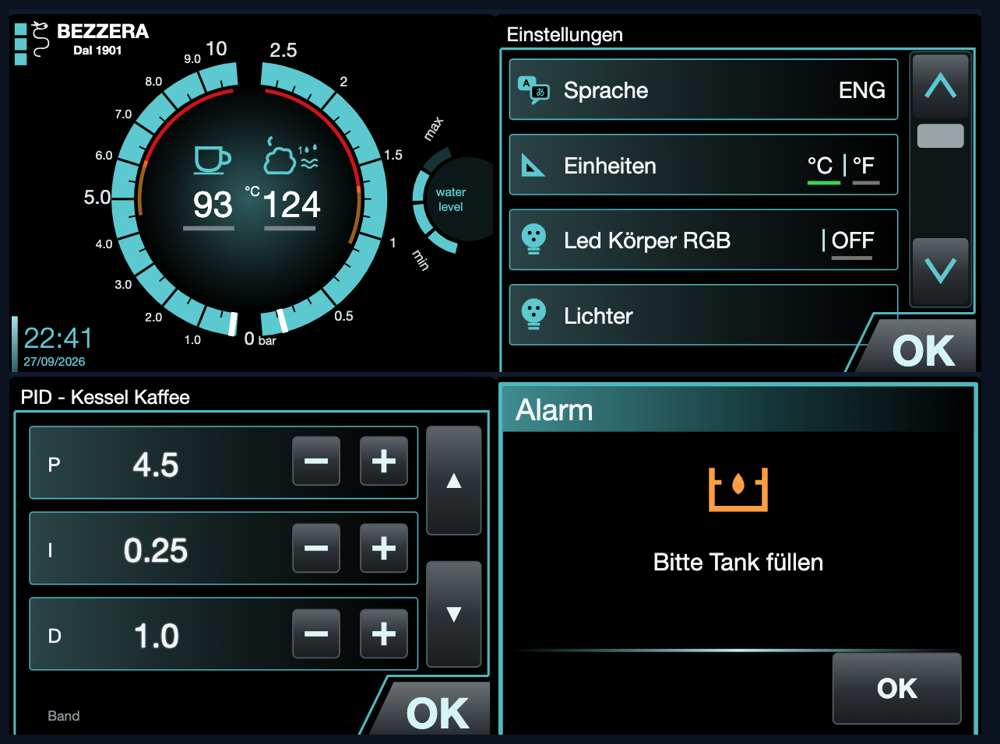

<h1 align="center">☕ Bezzera Duo Protocol</h1>

<p align="center">
  <b>Das Protokoll zwischen Mainboard und Touchdisplay der Bezzera Duo / Matrix</b> — entschlüsselt, dokumentiert<br />
  und mit einer ESP32-Bridge samt Weboberfläche nutzbar gemacht.
</p>

<p align="center">
  
  
  
  
  
</p>

<p align="center">
  Mitschneiden, verstehen, steuern — ohne die Maschinenlogik anzufassen: Das Mainboard bleibt der Chef,<br />
  der ESP32 sitzt nur in der Leitung und spricht dieselbe Sprache wie das Display.
</p>

<p align="center">
  
  <br />
  <sub><i>Der Display-Nachbau der Weboberfläche — gezeichnet nach den Bildschirmfotos im Bezzera-Handbuch und eigenen Fotos aller 300 Seiten, bedienbar mit den Tastenflächen aus dem Display-Flash.</i></sub>
</p>

---

## ✨ Überblick

Die Bezzera Duo DE/MN und die baugleiche Matrix haben ein 3,5"-Touchdisplay
(5963201.xx) am Mainboard (7661047.xx). Dieses Repo beschreibt, **was über die
vier Adern dazwischen läuft**, und liefert die Werkzeuge, um es zu lesen und
selbst zu sprechen. Ziel ist dasselbe wie beim Reddit-Projekt von
*Vivid-Ad-2039*: ein ESP32, der Register liest und schreibt.

✔ Protokoll gemessen: DWIN **Mini DGUS**, Rahmenkopf `C6 A5`, 115200 Baud, TTL  
✔ **Alle 300 Seiten** fotografiert und katalogisiert (drei Sprachen)  
✔ **Alle 1070 Tasten** mit Fläche, Folgeseite und Wert — gelesen aus dem Display-Flash  
✔ ESP32-Bridge: durchreichen, mitschneiden, einschleusen, Display emulieren  
✔ Weboberfläche mit Display-Nachbau, Live-Werten und Temperaturverlauf  
✔ Mehr als das Display: Ein/Aus aus der Ferne, Home Assistant, Brew by Weight, Verlauf über 24 h  

> ⚠️ In der Maschine liegen **230 V**. Netzstecker ziehen, bevor du etwas
> anklemmst. Mit laufender Maschine nur an bereits verlegte Messleitungen gehen.
> Kessel und Dampf sind heiß.

---

## 📸 Screenshots

<table>
  <tr>
    <td width="50%" align="center">
      <br />
      <b>Weboberfläche der Bridge</b>
    </td>
    <td width="50%" align="center">
      <br />
      <b>Tastenflächen aus dem Flash, eingeblendet</b>
    </td>
  </tr>
  <tr>
    <td width="50%" align="center">
      <br />
      <b>Nachgebaute Einstellungsseiten</b>
    </td>
    <td width="50%" align="center">
      <br />
      <b>Das Original (Webcam, Testwerte 13/14)</b>
    </td>
  </tr>
  <tr>
    <td colspan="2" align="center">
      <br />
      <b>Standby und Seitenmenü (Reinigen, Einstellungen, Rückspülen, Standby)</b>
    </td>
  </tr>
  <tr>
    <td colspan="2" align="center">
      <br />
      <b>Ein/Aus und Verlauf über 24 h (Simulation mit <code>web_lokal.py --demo</code>)</b>
    </td>
  </tr>
  <tr>
    <td colspan="2" align="center">
      <br />
      <b>Steckplan der Bridge mit Lochpositionen</b>
    </td>
  </tr>
</table>

---

## 📊 Stand

| Thema | Stand |
|---|---|
| Protokoll, Pegel, Adern | ✅ gemessen (Logic Analyzer, 2026-09-27) |
| Einschaltablauf, Temperaturen, Firmware-Version | ✅ zugeordnet |
| Seitenkatalog (0–299) | ✅ fotografiert, [`docs/seiten.md`](docs/seiten.md) |
| Tastentabelle (1070 Tasten) | ✅ aus dem Flash, [`docs/tasten.json`](docs/tasten.json) |
| Weboberfläche mit Display-Nachbau | ✅ alle Seiten, Klick = Berührung |
| Bridge durchreichen / mitschneiden | ✅ an der Maschine getestet |
| Display-Emulation (ESP32 antwortet) | 🟡 antwortet Byte für Byte richtig; Start der Maschine noch nicht durchgespielt |
| Hybridmodus (Display antwortet, ESP32 ersetzt Werte) | 🟡 kompiliert, noch nicht an der Maschine getestet |
| Tastendruck von außen wirkt wie ein echter | ⏳ offen |
| Ein/Aus, Home Assistant, Brew by Weight, Verlauf | 🟡 kompiliert, Oberfläche mit Simulation geprüft; an der Maschine und mit echter Waage noch nicht getestet |
| Dauerbetrieb (Passwort, OTA, Watchdog, Versorgung) | ⏳ offen |

---

## 🗂️ Inhalt

- [🔌 Hardware](#-hardware) — Display, Mainboard, Stecker und Adern ([Details](docs/bauteile.md))
- [📡 Das Protokoll](#-das-protokoll) — Mini DGUS, was gemessen wurde
- [🖥️ Seiten und Tasten](#️-seiten-und-tasten) — Katalog und Touch-Konfiguration aus dem Flash
- [🧪 Messen und mitschneiden](#-messen-und-mitschneiden) — Pegel, Logic Analyzer, Sniffer
- [🌉 ESP32-Bridge](#-esp32-bridge) — Verkabelung, Modi, Befehle, Weboberfläche
- [☕ Mehr als das Display](#-mehr-als-das-display) — Ein/Aus, Home Assistant, Brew by Weight, Verlauf
- [🧰 Werkzeuge](#-werkzeuge) — alle Skripte auf einen Blick
- [🧭 Nächste Schritte](#-nächste-schritte)
- [📚 Quellen](#-quellen)

---

## 🔌 Hardware

### Das Display

**DWIN DMT32240M035_07WTZ4**, Datumscode `180814` (August 2018), Aufdruck
„5V ONLY“. DWIN-Displays sind fertige serielle HMI-Module: Bilder, Schriften
und die Lage der Touchflächen liegen im Flash des Displays. Es hat **keine
Maschinenlogik** — es zeigt Variablen an und meldet Touch-Eingaben über UART.

- **Anschluss:** vier Adern direkt auf Lötpads am rechten Rand, mit Heißkleber
  gesichert. Pads von oben: `GND GND GND NC TXD RXD VCC VCC`. Belegt sind
  **GND (braun), TXD (gelb), RXD (weiß), VCC (grün)**, die Adern enden in einem
  weißen Zwischenstecker.
- **Pegel gemessen: TTL**, TXD +3,2 V im Ruhezustand. Der 16-polige IC neben den
  Pads ist kein Hindernis, RS-232 liegt nicht an.
- **Firmware-Version** (Register `0x00`): `0x22`. Auf dem Startbild steht „TFT 2.0“.
- **Speicher:** zwei TSOP-48-Bausteine (paralleler NAND-Flash bzw. RAM), **kein
  SPI-Flash** — mit einem CH341A lässt sich das Projekt nicht auslesen. Dazu ein
  microSD-Slot (nur zum Einspielen, `DWIN_SET`) und eine **leere**
  Knopfzellen-Halterung; die Uhr stellt das Mainboard.
- **Touch:** kapazitiv, Flachkabel `CDQ9439-3.5-A` mit eigenem Controller
  **SiS9252** und 6-poligem Stecker (`VDD` an Pin 6). Ersatzpanels aus dem
  Handel haben fast immer FocalTech- oder Goodix-Controller und passen deshalb
  vermutlich nicht.
- **Befund:** Beim Wackeln am 6-poligen Touch-Stecker piept das Display
  zeitweise — der Touch lebt, der Fehler ist ein **Wackelkontakt**. Die
  Touch-Register zeigten die letzte echte Berührung bei x=286, y=234, genau auf „OK“.
- **LCD-Panel:** vermutlich LQ035NC111, 3,5" QVGA mit 54-poligem RGB-Flachkabel.
- **Details** zu Zwischenstecker, SiS9252, Touch-Reparatur, LCD-Panel und
  Typnummer: [`docs/bauteile.md`](docs/bauteile.md).
- Eine unbestückte Reihe von 5 Pads in der Mitte ist vermutlich ein
  Programmier- oder Debug-Anschluss; unten sitzt ein unbenutzter DWIN-Stecker.

### Das Mainboard

**Hersteller ist PRO.EL.IND (Italien), nicht Gicar.** Deckelaufkleber
`SDEDB` / `BZ1PTE` / `7661047PR`, Produktionsaufkleber `1809` (September 2018).
Versorgung 12 V DC, Sicherung 3,15 A.

| Bauteil | Was es ist | Bedeutung |
|---|---|---|
| NXP **MC9S08PA32** (LQFP-64) | 8-Bit-MCU S08, 32 KB Flash | die ganze Maschinenlogik; spricht TTL |
| **CNPR**, 4-polige Stiftleiste | vermutlich BDM-Programmieranschluss | Werks-Update; bei gesetztem Security-Bit gesperrt — Finger weg |
| ST **M41T56** + Quarz + Knopfzelle | I²C-Echtzeituhr | stellt beim Start die Uhr im Display |
| RECOM-DC/DC-Wandler | 12 V → 5 V | die 5 V für das Display |
| ULN2003 + 5 Omron-Relais, TLP3063 | Relais- und Lasttreiber | Heizung Gruppe, Magnetventile, Pumpe |
| Stecker **CN6 „DISPLAY“** | 4 Adern | die Leitung zum Display |

Belegung laut Deckelaufkleber: Relaisausgänge 1 Heizung Gruppe, 2 EV Wassernetz,
3 EV Tank, 4 EV Füllen (Dampfkessel), 5 EV Gruppe, 6 Pumpe, 7 Common · Fühler NTC
Gruppe, NTC Kaffee, NTC Dampf, SSR Kaffee, SSR Dampf · **PRESS.** Drucksensor ·
**CAP. SENS** kapazitiver Füllstand · Klemmblock Durchflussmesser, Microswitch
(Hebel, nur MN), S.LIV · LED FRONT/RETRO · **KEYBOARD** (graues Flachbandkabel
zum Tastenfeld der DE). Das Mainboard ist also der Master
und hält PID, Sollwerte, Passwörter und Chrono — ein Mainboard-Reset setzt die
Passwörter auf 1901/1906.

### Stecker und Adern

| CN6-Pin (von links) | Originalkabel | Displaykabel / Ersatzkabel | Display-Pad | Signal |
|---|---|---|---|---|
| 1 | **rot** | **grün** | VCC | +5 V |
| 2 | **rosa** | **weiß** | RXD | Mainboard → Display, 4,8 V |
| 3 | **grün** | **gelb** | TXD | Display → Mainboard, 3,2 V |
| 4 | **schwarz** | **braun** | GND | GND |

Ein Ersatzkabel mit den Displayfarben ist damit 1:1 belegt.

Der weiße Zwischenstecker ist vermutlich **Molex Mini-Fit Jr.** (4,2 mm), das
komplette Kabel gibt es als Ersatzteil **Bezzera 7663518**. Teilenummern:
[`docs/bauteile.md`](docs/bauteile.md).

---

## 📡 Das Protokoll

### DWIN „Mini DGUS“

Die M-Serie von DWIN (DMT…M…) läuft mit „Mini DGUS“, dieselbe Familie wie im
Drucker Wanhao i3 Plus, für den [ADVi3++](https://github.com/andrivet/ADVi3pp)
das Protokoll implementiert hat:

```
Kopf | LEN | CMD | Parameter | Daten        LEN = Bytes ab CMD

80 reg daten...        Register schreiben     80 03 00 05  -> auf Seite 5 wechseln
81 reg n               Register lesen         Antwort: 81 reg n daten...
82 vpH vpL worte...    Variable schreiben     82 10 00 03 A7 -> VP 0x1000 = 935
83 vpH vpL n           Variable lesen         Antwort: 83 vpH vpL n worte...
84 ...                 Kurvendaten
```

Worte sind big-endian. Wichtige Register: `00` Firmware, `03` aktuelle Seite
(PIC_ID), `05`–`07` Touch, `1F`/`20` Uhr, `40`–`48` Flash-Zugriff (LibOP), `4F`
Tastencode.

### Gemessen an einer Duo DE

| | |
|---|---|
| Rahmenkopf | **`C6 A5`** (statt DWIN-Standard `5A A5`) |
| Baudrate | 115200, 8N1, nicht invertiert, **ohne CRC** |
| Pegel im Ruhezustand | Display-TXD +3,2 V, Mainboard-TX +4,8 V (TTL) |

**Einschaltablauf** (Mainboard → Display):

1. Seite 90, das Startbild mit „TFT 2.0“ und „FW: x.y“
2. VP `0x0063` = 21 schreiben und zurücklesen — **Verbindungstest**; das Echo muss stimmen
3. Uhr stellen (`80 1F 5A` + Datum/Uhrzeit in BCD) und zurücklesen
4. Seite 101, VP `0x0000` = 1, bei leerem Tank Seite 103

**Laufender Betrieb:**

| VP | Richtung | Takt | Bedeutung |
|---|---|---|---|
| `0x0000` | Mainboard liest | 100 ms | Tastencode des Displays (Navigation, Aktionen) |
| `0x0001` | Mainboard liest | 100 ms | zweiter Tastencode (selten) |
| `0x0002` | Mainboard liest | auf Einstellseiten | „OK“ in Einstellungen |
| `0x0050` | Mainboard schreibt | ~300 ms | 9 Worte Status: **Wort 3 Kaffeekessel °C, Wort 4 Servicekessel °C**; Wort 2 wird nach Seite 103 zu 1, Wort 7 = 3, Wort 5 war einmal für 1 s auf 1; Wort 0, 1, 6, 8 bisher 0 (kalte Maschine, leerer Tank) — dort werden die Drücke vermutet |
| `0x0063` | Mainboard schreibt | beim Start | Firmware-Version Mainboard × 10 (21 → „FW: 2.1“) |

**Drücke:** Der Startbildschirm hat laut Handbuch zwei Druckanzeigen, links
den **Pumpendruck 0–10 bar**, rechts den **Druck des Servicekessels
0–2,5 bar**; das Mainboard hat dafür den Anschluss PRESS. Welches Wort sie
trägt, zeigt ein Mitschnitt beim Aufheizen mit gefülltem Tank oder die
Variablen-Konfiguration (`14.bin`) aus dem Display-Flash.

Alle Tasten sind vom Typ `FDxx`: **Das Display meldet nichts von sich aus**,
das Mainboard fragt ab. Reine Seitenwechsel erledigt das Display lokal, ohne
dass das Mainboard davon erfährt.

---

## 🖥️ Seiten und Tasten

### 300 Seiten, drei Sprachen

| Bereich | Sprache |
|---|---|
| 0–95 | Englisch |
| 100–195 | Deutsch |
| 200–295 | Italienisch |
| 96–99, 196–199, 296–299 | leer |

Dieselbe Seite liegt in der anderen Sprache fast immer bei +100 bzw. +200
(Ausnahmen im Technikmenü). Fotos aller Seiten: [`docs/seiten/`](docs/seiten/),
Katalog mit Inhalt jeder Seite: [`docs/seiten.md`](docs/seiten.md).

### 1070 Tasten aus dem Display-Flash

Die Touch-Konfiguration (DGUS `13.bin`) liegt im Flash des Displays und lässt
sich über die LibOP-Register **nur lesend** (`0x41 = 0xA0`) in den
Variablenspeicher holen — anders als das Handbuch sagt, auch unterhalb der
Bereiche `0x40`. Ergebnis in [`docs/tasten.json`](docs/tasten.json): je Taste
Fläche, Folgeseite, Funktion und Wert.

| Funktion | wohin | Beispiel |
|---|---|---|
| Tastencode | VP `0x0000` | „OK“ auf „Bitte Tank füllen“ → 5, Kaffee → 7, Menü → 20 |
| „OK“ in Einstellungen | VP `0x0002` = 1 | Einstellungsseiten |
| ± ändert das Display selbst | VPs `0x0007`, `0x000B`, `0x0020`–`0x0032`, `0x005A`–`0x005F`, `0x0070`–`0x007E` | Vorbrühen `0x005C`, 0–50 in 5er-Schritten |

Fallen beim Lesen des Flashs:

- höchstens **32 Worte je Rahmen**, größere Antworten bleiben aus
- ab VP `0x2000` liegt ein interner Empfangspuffer, VP-Adressen über `0x3FFF` spiegeln
- ein Leseblock an Flash-Adresse `0x1000` scheitert immer — versetzt lesen
- vereinzelt kippen Bytes auf der Leitung: jeden Block zweimal lesen
- im Flash selbst ist auf der **englischen Seite 9** ein Byte beschädigt
  (`F3` statt `FE`); die Taste „Coffee“ der Kesselpriorität wirkt dort
  vermutlich nicht. Deutsch (109) und Italienisch (209) sind in Ordnung

Der Flash-Auszug selbst (`flash/`) liegt **nicht** im Repo — nur die daraus
gewonnene Tastentabelle.

**Was nicht geht:** Über die Datenleitung lässt sich keine Berührung
vortäuschen. Register `0x4F` wirkt nur bei Tasten, die dafür eingerichtet sind
(hier keine), und die Touch-Register `0x05`–`0x07` speichert das Display nur.
Tastendrücke kommen deshalb über die Antworten an das Mainboard in die Maschine.

---

## 🧪 Messen und mitschneiden

### Pegel prüfen, bevor etwas angeklemmt wird

Maschine an, Multimeter (DC), schwarz auf GND:

| gemessen im Ruhezustand | bedeutet | anklemmen über |
|---|---|---|
| ca. +3,3 V | TTL 3,3 V | direkt |
| ca. +5 V | TTL 5 V | Spannungsteiler 10k/20k |
| **ca. −5 bis −12 V** | **RS-232** | **MAX3232**, niemals direkt |

An der Duo DE gemessen: +4,8 V vom Mainboard, +3,2 V vom Display.

### Logic Analyzer (24 MHz, 8 Kanäle, „fx2lafw“)

```bash
brew install sigrok-cli
sigrok-cli -d fx2lafw --config samplerate=2m --time 45s -C D0,D1 -o boot.sr
python3 tools/sr2log.py boot.sr > boot.log          # UART, Baudrate automatisch
python3 tools/duo_sniff.py dgus --changes boot.log   # DGUS-Rahmen, Kopf automatisch
python3 tools/duo_live.py                           # Live-Anzeige direkt vom Analyzer
```

Alternativ [PulseView](https://sigrok.org/wiki/Downloads) (Windows: vorher
WinUSB per Zadig). Rohmitschnitte mit Beschreibung: [`captures/`](captures/).

<details>
<summary><b>Fallen mit dem fx2lafw-Klon (macOS, Apple Silicon)</b></summary>

- **Nur mit USB High Speed (480 Mb/s).** Bei „Link Speed: 12 Mb/s“ bricht jede
  Aufnahme mit `LIBUSB_ERROR_PIPE` ab — anderes Kabel oder anderen Port nehmen.
- macOS fragt beim Einstecken „Zubehör verbinden?“; bis dahin ist das Gerät unsichtbar.
- Vor dem Laden der Firmware meldet er sich ohne Namen (`0925:3881`);
  `sigrok-cli --scan` lädt sie, danach heißt er `fx2lafw`.
- **Eine geänderte Abtastrate gilt erst ab dem nächsten Lauf.** Die erste
  Aufnahme nach einem Wechsel ist falsch beschriftet, die Baudrate erscheint
  verdoppelt oder halbiert. Vorlauf mit `--samples 1000`; `duo_live.py` macht das selbst.

</details>

### ESP32-Sniffer (nur lesen)

[`sniffer/duo_sniffer/duo_sniffer.ino`](sniffer/duo_sniffer/duo_sniffer.ino) für
jedes klassische ESP32-Devkit: zwei UART-Eingänge, sendet nichts, das Display
läuft normal weiter. Ausgabe über USB mit 921600 Baud im Log-Format von
`duo_sniff.py`, Markierungen mit `m <text>`, Baudrate mit `b`, Invertierung
mit `i`, `scan` misst Ruhepegel und kürzesten Puls.

Abgriff am saubersten über einen Y-Adapter für den Zwischenstecker: je ein
Buchsen- und Steckergehäuse mit Kontakten (Mini-Fit Jr.: 39-01-4040 +
39-01-4046, 39-00-0038 + 39-00-0041), 1:1 durchverdrahtet mit Abzweig an TX,
RX und GND; +5 V bleibt frei. Vorher das Raster messen, bei 3,0 mm die
Micro-Fit-Teile nehmen. Eine 2,54-mm-Stacking-Leiste passt nicht.

```
Datenleitung 1 ──[10k]──┬── GPIO16 (Kanal A)      Spannungsteiler nur bei 5-V-Pegel
                        └──[20k]── GND
Datenleitung 2 ──[10k]──┬── GPIO17 (Kanal B)
                        └──[20k]── GND
GND Maschine ──────────────── GND ESP32
```

---

## 🌉 ESP32-Bridge

Firmware [`bridge/duo_bridge/`](bridge/duo_bridge/) für den **Waveshare
ESP32-S3-ETH**. Der ESP32 sitzt *in* der Leitung, reicht Rahmen durch,
schneidet mit, schiebt eigene Rahmen ein oder beantwortet das Mainboard selbst.

```bash
arduino-cli core install esp32:esp32
FQBN=esp32:esp32:esp32s3:CDCOnBoot=cdc,PartitionScheme=min_spiffs,PSRAM=opi
arduino-cli compile --fqbn $FQBN bridge/duo_bridge
arduino-cli upload  --fqbn $FQBN -p /dev/cu.usbmodem… bridge/duo_bridge
```

Mit Bluetooth passt die Firmware nicht mehr in die Standardpartition (1,2 MB),
deshalb `min_spiffs` (1,9 MB). `PSRAM=opi` für den ESP32-S3R8 des Waveshare-Boards:
Der Verlauf reicht damit 24 h statt 30 min. Ohne PSRAM läuft alles andere gleich.

### Verkabelung

Steckplan mit Lochpositionen: [`docs/breadboard_hybrid.png`](docs/breadboard_hybrid.png).

| Verbindung | wie |
|---|---|
| Mainboard **schwarz** (Ersatzkabel braun) + Display **braun** | ESP32 **GND** |
| Mainboard **rot** (grün) ↔ Display **grün** | direkt, **nicht** an den ESP32 |
| Mainboard **rosa** (weiß) | **10 kΩ → GPIO17**, GPIO17 **20 kΩ → GND** |
| ESP32 **GPIO18** | → Display **weiß** |
| Display **gelb** | → ESP32 **GPIO15** |
| ESP32 **GPIO16** | → Mainboard **grün** (gelb) |
| ESP32 **5V** | frei |

**Nur Display, ohne Maschine** (Seiten durchschalten, Flash lesen): Display
grün an ESP32 **5V**, braun an GND, gelb an GPIO15, weiß an GPIO18.

<details>
<summary><b>Fallen beim Aufbau</b></summary>

- **Display-braun und Display-grün vertauscht verpolt das Display.** Seine
  Schutzdiode schließt dann die 5 V der Maschine kurz (~0 V an der Versorgung).
  Das Display hat es überstanden.
- **Ohne gemeinsame Masse** kommen nur Störbytes an: Maschinen-GND direkt an
  einen GND-Pin des ESP32.
- **10 kΩ und 20 kΩ vertauscht** ergibt ~1,6 V an GPIO17, genau im Grenzbereich —
  Datensalat. Richtig: 10 kΩ zwischen Leitung und GPIO17, 20 kΩ nach GND.
- **Nie das Display zusätzlich direkt an die Maschine stecken**, solange der
  ESP32 in der Leitung ist: zwei Sender auf einer Leitung, 5 V aus zwei Quellen.

</details>

### Modi

| Modus (`e`) | Wer antwortet dem Mainboard | wofür |
|---|---|---|
| **0** durchreichen | das Display | mitschneiden; `o` schleust einzelne Tastendrücke ein |
| **1** Emulation | der ESP32 aus seinem Modell (VPs, Register, laufende Uhr) | ohne Display; muss den Start der Maschine mitbekommen |
| **2** Hybrid | das Display, per Web/`w` gesetzte VPs ersetzt der ESP32 | Steuern bei laufendem Display |

Der Modus wird gespeichert und gilt auch nach einem Neustart.

**Befund zum Start ohne Display:** Ohne Antwortleitung des Displays startet
die Maschine nicht weiter, mit Display parallel zum ESP32 stürzt sie ab (zwei
Antworten gleichzeitig). Vermutliche Ursache ist der Verbindungstest mit VP
`0x0063`: Der Emulator hatte den Schreibvorgang verpasst, weil der Teiler an
GPIO17 zu der Zeit falsch war, und mit 0 geantwortet. Mit richtigem Teiler
kamen auch ohne Display gültige Rahmen. Ein „Startbyte“ des Displays gibt es nicht.

### Befehle über USB

`python3 tools/bridge.py "<befehl>"` oder `arduino-cli monitor -p … -c baudrate=921600`:

| Befehl | Wirkung |
|---|---|
| `p <seite>` | Display auf Seite schalten |
| `w <vp> <wort> …` | VP im Display (und im Modell) schreiben |
| `o <vp> <wert> [n]` | die nächsten n Antworten auf „VP lesen“ überschreiben — Tastendruck fürs Mainboard |
| `d <hex …>` / `m <hex …>` | Rohbytes an Display / Mainboard |
| `s <von> <bis> [ms]` | Seiten durchschalten |
| `e [0\|1\|2]` | Modus: durchreichen, Emulation, Hybrid |
| `n <ssid> <passwort>` | Heim-WLAN speichern (nur 2,4 GHz); `n ?` listet Netze, `n -` löscht |
| `j [seit]` | Zustand als JSON-Zeile `#J {…}` |
| `z <pfad> [rumpf]` | Zusatz-API wie im Web, z. B. `z /api/aktion an`; Antwort als Zeile `#Z …` |
| `M <hex …>` / `D <hex …>` | Test: Rahmen behandeln, als käme er vom Mainboard / Display |
| `x` / `?` | Mitschnitt-Ausgabe an/aus / Zustand |

### Weboberfläche

- **Am Rechner, ohne WLAN:** `python3 tools/web_lokal.py` → http://localhost:8080,
  spricht per USB mit dem ESP32. Mit `--demo` ganz ohne ESP32: simulierte
  Maschine und Waage.
- **Eigenes WLAN** `duo-bridge` → http://192.168.4.1, im Heimnetz http://duo.local
  oder per Ethernet (W5500).

Sie zeigt den **Nachbau des Displays** (320 × 240, SVG, alle Seitentypen) mit
Live-Werten; ein Klick wirkt wie eine Berührung an dieser Stelle — Wert
schreiben, ± mit den Grenzen aus dem Flash, Seite wechseln. Dazu Ein/Aus,
Verlauf, Brew by Weight, Einstellungen, alle VPs, Ereignisprotokoll und Seitenkatalog. Die Lampe
„Mainboard“ leuchtet nur bei gültigen Rahmen; Störbytes stehen im Protokoll.

> 🔒 Kein Login, und das Passwort des eigenen WLANs steht hier öffentlich —
> nur zum Testen im eigenen Netz betreiben. Für den Dauerbetrieb kommt ein
> eigenes Passwort auf dem ESP32 (siehe [Nächste Schritte](#-nächste-schritte)).

---

## ☕ Mehr als das Display

Alles läuft im ESP32 selbst, auch ohne offene Weboberfläche. Einstellungen
(MQTT, Waage, Stopp-Ausgang, Druckwort) stehen im Kasten „Einstellungen“ der
Weboberfläche und liegen im NVS des ESP32, nie im Quelltext.

| Funktion | wie | Stand |
|---|---|---|
| **Ein/Aus aus der Ferne** | schreibt VP `0x0000` = 1 und Seite x01 („Für Start drücken“) bzw. VP `0x0000` = 0 und Seite x00 („Standby“ im Seitenmenü), genau wie diese Tasten laut Touch-Konfiguration | aus der Tastentabelle abgeleitet, an der Maschine offen |
| **Home Assistant** | MQTT mit Discovery, siehe unten | kompiliert, gegen einen Broker offen |
| **Verlauf** | VP `0x0050` einmal je Sekunde in einem Ringpuffer, 24 h mit PSRAM (sonst 30 min); Kurve 10 min bis 24 h | mit Simulation geprüft |
| **Druckkurven** | sobald bekannt ist, welches Wort in VP `0x0050` den Druck trägt: „Rohworte zeigen“ im Verlauf, Pumpe laufen lassen, steigendes Wort unter Einstellungen eintragen | Wort noch unbekannt |
| **Brew by Weight** | Bluetooth- oder WLAN-Waage, Bezug wird erkannt, Kurve aus Gewicht, Durchfluss und Druck, Stopp bei Ziel minus gelerntem Vorlauf über die Stopp-Taste des Tastenfelds | Protokolle aus Quellen, mit echter Waage offen; Anschluss am Tastenfeld noch zu messen |
| **Bezüge zählen, Alarme melden** | Zähler im NVS, Alarmseiten (Tank, Wartung, Filter …) als Zustand und Alarm | mit Simulation geprüft |

<p align="center">
  <br />
  <sub>Druckwort suchen: „Rohworte zeigen“ im Verlauf. Hier in der Simulation steigt Wort 1 bei laufender Pumpe.</sub>
</p>

### Abgleich mit den Messungen

Alle Mitschnitte in [`captures/`](captures/) stammen von der kalten Maschine mit
leerem Tank (Temperaturen 22–36 °C, Seite 103 „Bitte Tank füllen“). Ein Bezug
ist noch nie auf der Leitung gewesen. Daraus folgt:

| Annahme der Zusatzfunktionen | gemessen / belegt | offen |
|---|---|---|
| Ein = VP `0x0000` → 1 | Das Mainboard schreibt beim Einschalten selbst VP `0x0000` = 1 (`boot.sr`); Taste „Für Start drücken“ schreibt 1 (Flash, DE und IT) | ob das Mainboard auf eine von außen gesetzte 1 reagiert |
| Standby = VP `0x0000` → 0 | Taste „Standby“ im Seitenmenü schreibt 0 (Flash, alle drei Sprachen) | nie mitgeschnitten |
| Zustand aus dem Tastenwert | Das Display meldet VP `0x0000` alle 100 ms (`boot.sr`, `home.sr`, `tank.sr`); nach „OK“ blieb er auf 5 stehen | — |
| Alarme aus der Seite | Seite 103 schaltet das Mainboard selbst (Register `0x03`, `boot.sr`) | andere Alarme |
| Druckwort in VP `0x0050` | Wort 0, 1, 6, 8 immer 0 — die Pumpe lief nie | welches Wort bei laufender Pumpe steigt |
| Ausgabezähler auf Seite x06 | Foto der Seite 106: nur Zeiger Pumpendruck und große Zahl; Handbuch 5.4.4 | ob das Mainboard beim Bezug dorthin schaltet, welche VP die Zeit trägt |
| Stopp über das Tastenfeld | Handbuch 5.4; Stecker KEYBOARD am Mainboard (Foto) | Belegung des Flachbandkabels |

Den Zustand „an/Standby“ liest die Bridge deshalb am Tastenwert, nicht an der
Seite: Seitenwechsel per Touch macht das Display ohne Meldung ans Mainboard.
Der nächste Mitschnitt sollte ein ganzer Bezug mit vollem Tank sein.

### Home Assistant


Unter Einstellungen den Broker eintragen (z. B. `mqtt://homeassistant.local:1883`,
Benutzer und Passwort des Mosquitto-Add-ons). Home Assistant findet das Gerät
**Bezzera Duo** dann von selbst:

| Entität | Art |
|---|---|
| Kaffeekessel, Servicekessel | Temperatur °C |
| Pumpendruck, Druck Servicekessel | Druck bar, erst sobald das Druckwort eingetragen ist |
| Zustand, Alarm (mit Text) | „Standby“, „an“, „Alarm: Tank füllen“ … |
| Maschine | Schalter Ein/Standby |
| Gewicht, Durchfluss, Bezug läuft, Letzter Bezug, Dauer, Bezüge | nur mit Waage |
| Zielgewicht, Tara | Zahl und Knopf, nur mit Waage |

Themen: `duo/<id>/zustand` (JSON), `duo/<id>/verfuegbar`, `duo/<id>/ereignis`
(`bezug_start`, `ziel_erreicht`, `bezug_fertig`), Befehle unter
`duo/<id>/set/maschine|ziel|tara|aktion`. `<id>` sind die letzten sechs Stellen
der MAC, die Weboberfläche zeigt das Basisthema an. Zeitpläne und
Benachrichtigungen („Maschine heiß“, „Tank leer“) laufen als Automationen in
Home Assistant, zum Beispiel:

```yaml
automation:
  - alias: Espresso vorheizen
    triggers: [{trigger: time, at: "06:30:00"}]
    conditions: [{condition: time, weekday: [mon, tue, wed, thu, fri]}]
    actions: [{action: switch.turn_on, target: {entity_id: switch.bezzera_duo_maschine}}]
  - alias: Espresso bereit
    triggers: [{trigger: numeric_state, entity_id: sensor.bezzera_duo_kaffeekessel, above: 92}]
    actions: [{action: notify.notify, data: {message: "Die Duo ist heiß."}}]
```

### Brew by Weight

<br clear="right" />

<p align="center">
  <br />
  <sub>Laufender Bezug in der Simulation: Gewicht (weiß) mit Ziellinie, Durchfluss (grün), Pumpendruck (blau), darunter die letzten Bezüge.</sub>
</p>

**Waagen**, Auswahl unter Einstellungen:

| Art | Waagen | Hinweis |
|---|---|---|
| Bluetooth | Acaia (Lunar, Pearl, Pyxis, Cinco), BOOKOO Themis, Felicita Arc/Incline, Decent Scale / Half Decent | die erste gefundene, oder feste Adresse eintragen. Protokolle nach [AcaiaArduinoBLE](https://github.com/tatemazer/AcaiaArduinoBLE), [BooKoo](https://github.com/BooKooCode/OpenSource) und [Decent](https://decentespresso.com/decentscale_api) |
| WLAN: URL abfragen | alles mit HTTP-Schnittstelle, z. B. ESPHome mit HX711 (`http://waage.local/sensor/gewicht`) | Antwort als Zahl oder JSON mit `value`, `weight` oder `gewicht`, etwa 8 Abfragen je Sekunde |
| WLAN: Waage meldet selbst | `POST http://duo.local/api/waage` mit dem Gewicht in g, oder ein MQTT-Thema | Tara für WLAN-Waagen macht die Bridge selbst |

**Ablauf:** Tasse auf die Waage, Bezug mit der Dauerausgabe-Taste starten
(Portionstasten gehen auch, dann stoppt zusätzlich die Volumetrik). Die Bridge
erkennt den Bezug an den ersten Tropfen (gleichmäßig steigendes Gewicht, kein
Sprung) oder, sobald das Druckwort bekannt ist, am Pumpendruck. Die Zeit zählt
ab da. Erreicht Gewicht + Vorlauf das Ziel, kommt die Meldung „Ziel erreicht –
Bezug stoppen!“ in der Weboberfläche und als Ereignis `ziel_erreicht` in Home
Assistant. Nach dem Bezug lernt die Bridge den Vorlauf (was nach dem Stopp noch
nachtropft) mit halber Schrittweite nach.

**Stoppen über das Tastenfeld.** Die DE hat ein Tastenfeld mit fünf Tasten:
vier Portionen (volumetrisch über den Durchflussmesser) und die Taste
Dauerausgabe/Programmierung/Stop. Laut Handbuch (5.4) beendet ein erneuter
Druck auf die Dauerausgabe-Taste die Ausgabe, das Mainboard stoppt die Pumpe
dann selbst. Das Tastenfeld hängt über das graue Flachbandkabel direkt am
Stecker **KEYBOARD** des Mainboards, nicht an der Displayleitung. Die Tasten
selbst kommen über die Displayleitung also nicht an; die Bridge muss die Taste
elektrisch „drücken“:

- Unter „Stopp-Taste am Tastenfeld“ einen freien GPIO wählen (1, 2, 38–42, 47, 48).
  Bei Ziel schaltet er für die eingestellte Dauer (Standard 300 ms), also ein
  kurzer Tastendruck. Home Assistant bekommt dazu den Knopf „Bezug stoppen“.
- Am GPIO ein **Optokoppler** (z. B. PC817 mit 330 Ω vor der LED), dessen
  Ausgang parallel zu den beiden Kontakten der Dauerausgabe-Taste liegt. Der
  Optokoppler trennt ESP32 und Mainboard galvanisch; die Taste selbst funktioniert
  weiter.
- **Noch offen, vor dem Anschließen messen:** Belegung des Flachbandkabels
  (Einzeltasten gegen eine gemeinsame Leitung oder Matrix), Pegel und Polarität
  an der Taste. Maschine dafür ausschalten und am stromlosen Kabel mit dem
  Durchgangsprüfer die Kontakte der Taste suchen. Das Tastenfeld arbeitet mit
  Kleinspannung vom Mainboard; nie auf der 230-V-Seite eingreifen.

Ohne diesen Anschluss meldet die Bridge „Ziel erreicht – Bezug stoppen!“ in der
Weboberfläche und als Ereignis in Home Assistant, gedrückt wird von Hand.

Zusätzlich ungeklärt: Laut Handbuch (5.4.4) zeigt das Display während der
Ausgabe einen Bildschirm mit Pumpendruck und Ausgabedauer. Das Mainboard
schickt beides also über die Displayleitung. Ein Mitschnitt während eines
Bezugs zeigt, welche Seite und welche Worte das sind — dann erkennt die Bridge
den Bezug direkt am Mainboard statt an der Waage.

---

## 🧰 Werkzeuge

Alle Python-Skripte brauchen nur die Standardbibliothek.

| Skript | wofür |
|---|---|
| [`tools/sr2log.py`](tools/sr2log.py) | sigrok-Mitschnitt (`.sr`) → Log, UART-Dekodierung, Baudrate automatisch |
| [`tools/duo_sniff.py`](tools/duo_sniff.py) | Log auswerten: `dgus` (Rahmenkopf automatisch), `stats`, `gicar`, `diff` |
| [`tools/duo_live.py`](tools/duo_live.py) | Live-Anzeige im Terminal direkt vom Analyzer oder als Replay |
| [`tools/bridge.py`](tools/bridge.py) | Befehle an die Bridge schicken und mitlesen |
| [`tools/web_lokal.py`](tools/web_lokal.py) | Weboberfläche am Rechner über USB; `--demo` ohne ESP32 |
| [`tools/web_demo.py`](tools/web_demo.py) | simulierte Maschine und Waage für `--demo` |
| [`tools/seiten_foto.py`](tools/seiten_foto.py) | alle Seiten durchschalten und per Webcam fotografieren (`brew install imagesnap`) |
| [`tools/libop_lesen.py`](tools/libop_lesen.py) | Flash-Bereiche des Displays lesen — kennt nur den Lesemodus |
| [`tools/touch13.py`](tools/touch13.py) | Touch-Konfiguration dekodieren → JSON und Header für die Bridge |
| [`tools/tasten_scan.py`](tools/tasten_scan.py) | Tastencodes über Register `0x4F` probieren (an diesem Display ohne Wirkung) |

Tests: `python3 -m unittest discover -s tests`

---

## 🧭 Nächste Schritte

1. **Hybridmodus an der Maschine testen:** „OK“ auf „Bitte Tank füllen“ über
   die Weboberfläche — reagiert das Mainboard wie auf einen echten Druck?
2. **Emulation mit vollständigem Start:** ESP32 vor der Maschine einschalten,
   Start mitschneiden, dann ohne Display betreiben.
3. **Dauerbetrieb:** eigenes Passwort und Login, abschaltbares eigenes WLAN,
   Firmware-Update per WLAN (OTA), Watchdog, Versorgung aus der Maschine
   (5-V-Budget prüfen) und feste Verkabelung statt Breadboard.
4. **Mehr als das Display an der Maschine prüfen:** Ein/Aus, Druckwort in VP
   `0x0050` finden (Rohworte im Verlauf), Home Assistant gegen den Broker,
   Brew by Weight mit einer echten Waage; einen Bezug mitschneiden (Seite und
   Worte für Pumpendruck und Ausgabedauer); für den automatischen Stopp die
   Dauerausgabe-Taste im Flachbandkabel des Tastenfelds durchmessen.
5. **Variablen-Konfiguration (`14.bin`)** ebenfalls aus dem Flash lesen: Sie sagt,
   welche VP an welcher Stelle angezeigt wird — damit auch die Sollwerte auf den
   Kaffee- und Tee-Seiten.
6. **Touch reparieren oder ersetzen:** Kontakt am 6-poligen Stecker reinigen
   ([Anleitung](docs/bauteile.md));
   alternativ den SiS9252 per I²C mitschneiden und vom ESP32 nachbilden lassen.

<details>
<summary><b>Frühere Annahmen, die sich nicht bestätigt haben</b></summary>

- **Gicar-Steuerung:** Händler nennen sie „Gicar PID controller“
  ([Whole Latte Love](https://www.wholelattelove.com/products/bezzera-matrix-mn-dual-boiler-espresso-machine)).
  Bei dieser Duo DE (2018) ist das Board von PRO.EL.IND. Die Gicar-Protokolle
  ([antondlr/gicar-serial](https://github.com/antondlr/gicar-serial),
  [lelit-bianca-protocol](https://github.com/magnusnordlander/lelit-bianca-protocol))
  erkennt `duo_sniff.py` trotzdem weiter (`gicar`, `stats`).
- **RS-232 zum Mainboard:** wegen des 16-poligen IC neben den Pads vermutet,
  gemessen ist TTL.
- **Temperatur als Wert × 10:** bei DGUS üblich, hier sind es ganze Grad.
- **Projekt per CH341A aus dem SPI-Flash lesen:** Es gibt keinen SPI-Flash.

</details>

<details>
<summary><b>Recherche (2026-09-24)</b></summary>

| Suche | Ergebnis |
|---|---|
| GitHub-Code `setwarmup bezzera`, `"/set/espresso"` | 0 Treffer |
| GitHub-Nutzer `Vivid-Ad-2039` | existiert nicht |
| GitHub-Repos `bezzera` | [BB005-Mühlentimer](https://github.com/hellgelino/bezzera-bb005-digital-timer), [bezzi-tank](https://github.com/hcrohland/bezzi-tank) (Ultraschall-Füllstand) |
| `bezzera duo esp32` | [brewos-io/firmware](https://github.com/brewos-io/firmware): ersetzt die ganze Steuerung, Duo/Matrix ungetestet |
| `DMT32240M035_07WTZ4` | kein Datenblatt zu genau dieser Variante; `_07` und `Z4` vermutlich kundenspezifisch |

1st-line führt `7661047PR` als Mainboard „1.2“, das Display meldet „FW: 2.1“ —
entweder später aktualisiert, oder die Zahlen bedeuten nicht dasselbe.

</details>

---

## 📚 Quellen

- Bezzera: Bedienungsanleitung „Matrix Duo“ (IT/EN/FR/DE/ES/ZH, 2018 und 2020), mit Bildschirmfotos der Oberfläche in Originalauflösung —
  [Whole Latte Love](https://www.wholelattelove.com/cdn/shop/files/Bezzera_DUO_Matrix_Manual.pdf),
  [kaffee24.de](https://www.kaffee24.de/media/e8/95/94/1677585579/W904059%20Bedienungsanleitung%20Bezzera%20Duo%20MN.pdf?ts=1677585579).
  Vorlage für Farben, Symbole und Skalen des Nachbaus; die Bilder selbst liegen nicht im Repo
- [Clive Coffee: Technician Menu and Reset](https://support.clivecoffee.com/en/articles/16425965-bezzera-duo-de-mn-accessing-the-technician-menu-and-resetting-the-machine) — Weg ins Technikmenü, Werkspasswort
- [andrivet/ADVi3pp](https://github.com/andrivet/ADVi3pp), `Marlin/src/advi3pp/core/dgus.h`: Mini-DGUS-Befehle und Register
- [Sébastien Andrivet: DWIN Mini DGUS Display Development Guide (non-official)](https://sebastien.andrivet.com/en/posts/dwin-mini-dgus-display-development-guide-non-official/)
- DWIN DGUS Development Guide [v4.0 (2014)](https://cdn.papouch.com/data/user-content/old_eshop/files/DIS_DMT48270T043_3WT/dwin-dgus-dev-guide_v40_2014.pdf), [v4.3 (2015)](https://whiteelectronics.pl/img/cms/DWIN_DGUS_DEV_GUIDE_V43_2015.pdf): DGUS-Register, LibOP, Touch-Konfiguration (Kapitel 7)
- [dwinhmi/DWIN_DGUS_HMI](https://github.com/dwinhmi/DWIN_DGUS_HMI): offizielle Bibliothek für DGUS II
- [1st-line: Matrix/Duo Software-Kompatibilität](https://www.1st-line.com/technical-support/bezzera-technical-support/bezzera-matrix-duo-software-compatibility-changes/)

---

## 👤 Autor

Gebaut und gepflegt von **Lars Zumpe** — Messungen an einer Bezzera Duo DE von 2018.

Keine Verbindung zu Bezzera, PRO.EL.IND oder DWIN. Namen und Marken gehören
ihren Eigentümern; die Seitenfotos zeigen die Werksoberfläche nur zur
Dokumentation. Eingriffe in die Maschine auf eigene Gefahr.
