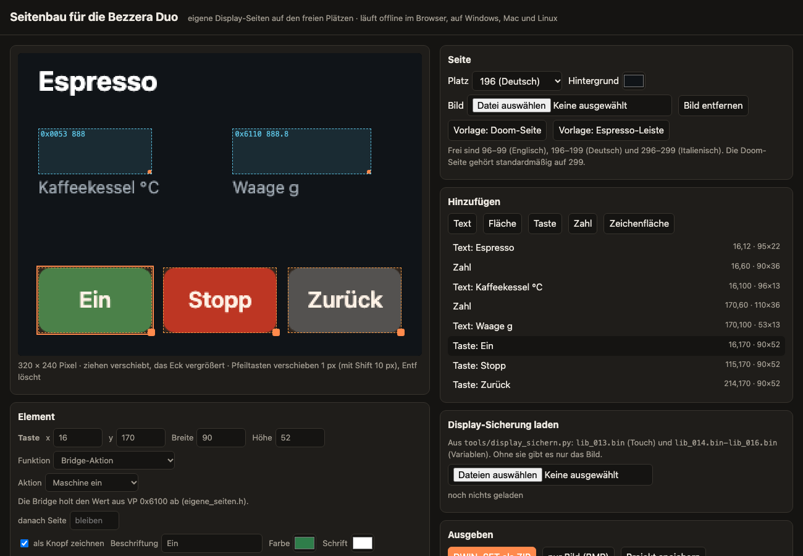

# Eigene Display-Seiten und Doom

Stand: 🧪 gebaut, am Display ungetestet. Formate aus dem DGUS-Handbuch V4.3 und
dem ausgelesenen Display-Flash. Der Seitenbau reproduziert die Touch-Datei
byte-genau.

## Seitenbau

**[Seitenbau öffnen](https://larszu.github.io/bezzera-duo-protocol/seitenbau/)**
oder offline `tools/seitenbau/index.html` im Browser. Er läuft unter Windows, Mac und Linux und
braucht weder Installation noch SDK.

1. Display sichern: `python3 tools/display_sichern.py alles` ([Anleitung](display_sichern.md)).
2. Im Seitenbau `lib_013.bin` bis `lib_018.bin` aus der Sicherung laden (Variablen: je 64 Seiten eine Bibliothek).
3. Platz wählen (96–99, 196–199, 296–299), Hintergrund, Texte, Tasten und Zahlen setzen.
4. **DWIN_SET als ZIP** exportieren, den Ordner auf eine leere FAT32-SD-Karte kopieren,
   bei ausgeschalteter Maschine ins Display stecken, einschalten, warten, Karte ziehen, neu starten.

Die ZIP enthält das Hintergrundbild (`<seite>.bmp`, 24 Bit) und die vollständigen
`13.bin` (Touch) und `14.bin` (Anzeigen) aus der Sicherung. Darin sind nur die
Einträge der gewählten Seite ersetzt.

| Element | landet in | Wirkung |
|---|---|---|
| Text, Fläche, Knopfgrafik | Hintergrundbild | statisch, beliebige Schrift des Rechners |
| Taste: Seite wechseln | 13.bin, `Pic_Next` | das Display wechselt selbst |
| Taste: Bridge-Aktion | 13.bin, Tastencode `FD05` auf VP `0x0300` | die Bridge holt den Wert ab: 1 Ein, 2 Standby, 3 Bezug stoppen, 4 Tara, 5 Doom, 10–29 Profil 1–20 |
| Taste: Tastencode | 13.bin, `FD05` auf VP `0x0000` | wie eine Originaltaste ans Mainboard |
| Zahl | 14.bin, Datenvariable `0x10`, Schrift aus einer vorhandenen Anzeige | Werte des Mainboards (`0x0053` …) oder der Bridge (`0x0310` …) |
| Zeichenfläche | 14.bin, Basic Graphics `0x21` | die Bridge zeichnet hinein (Doom) |

Werte der Bridge (nur solange eine eigene Seite zu sehen ist, alle 500 ms):
`0x0310` Gewicht g×10, `0x0311` Bezugszeit s×10, `0x0312` Bezüge seit Rückspülen,
`0x0313` Bezüge gesamt, `0x0314` Uhrzeit hhmm, `0x0315` aktives Profil.

**Risiko:** Die SD-Karte überschreibt Touch- und Anzeigekonfiguration aller
Seiten. Stammen 13/14.bin aus einer fehlerhaften Sicherung, sind auch die
Originalseiten betroffen. Dann mit der unveränderten Sicherung zurückspielen.

## Doom

Zehnmal schnell auf den Schriftzug der Startseite tippen (rechts neben der
Menütaste), am Display oder im Nachbau der Weboberfläche.

Voraussetzungen:
- **Doom-Seite:** Seitenbau → *Vorlage: Doom-Seite* → Platz 299 → ZIP → SD-Karte.
  Sie trägt zwei Zeichenflächen: VP `0x0800` (Bitmap 96×62) und `0x1FC0` (vergrößern).
- **WAD-Datei:** Weboberfläche → Diagnose → Doom → hochladen, z. B. die
  Shareware-`doom1.wad` (4 MB). Die Datei liegt nur auf dem ESP32, nicht im Repo.
  Ohne WAD brennt das Doom-Feuer.

Steuerung am Display: oben links Menü (3 s halten = zurück zur Maschine), oben
Mitte Enter, oben rechts Benutzen; links/rechts drehen, Mitte vor, darunter
Feuer, unten zurück. In der Weboberfläche mit der Tastatur.

Während Doom läuft, beantwortet die Bridge das Mainboard selbst und merkt sich
die Seite, die es zeigen will. Ein Alarm der Maschine, 3 Minuten ohne Touch
oder „Zurück zur Maschine“ beenden Doom. Das Spiel bleibt pausiert, und das nächste
Easter Egg macht dort weiter. „Quit“ im Doom-Menü braucht danach einen Neustart der Bridge.

| Punkt | Stand |
|---|---|
| Doom (doomgeneric) auf dem ESP32-S3, Tabellen im PSRAM | 🧪 kompiliert |
| Bitmap-Befehl `0x000F` und Vergrößern `0x0010` | 💡 laut Handbuch; ob Vergrößern so wirkt, zeigt erst der Test |
| Bildrate bei 115200 Baud | 💡 grob 0,5–2 Bilder/s (nur geänderte Pixel gehen raus) |
| Turbo: Display kurz auf 921600 Baud (Register R1, `0xA5` = ohne Speichern) | 🧪 aus; nach Aus/Ein wieder 115200 |
| Touch über Register `0x05`–`0x0A` | 💡 laut Handbuch |

## DGUS-SDK auf dem Mac

Für eigene Seiten nicht nötig. Wer Schriften oder Symbolbibliotheken bauen will:
`bash tools/dgus_sdk_mac.sh` richtet Wine und das SDK 5.10 ein, `… start` startet es.

## Lizenz

Doom stammt aus [doomgeneric](https://github.com/ozkl/doomgeneric) (GPL-2.0,
`bridge/duo_bridge/src/doom`, angepasst: Palette, PSRAM, Beenden). Das ganze
Projekt steht unter GPL-2.0 ([LICENSE](../LICENSE)).
